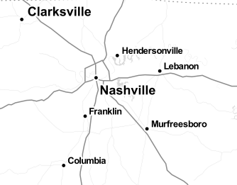

layout: true
class: center, middle, inverse
---
#An intro to geospatial development 
Eric Goddard  
Center for Applied Earth Science and Engineering Research
---
layout: false
class: left, middle
# Outline   
.left[
- GIS crash course 
- Why you should learn about spatial 
- Web app 
]
---
# Geographic Information Systems
--

##GIS -  A system for managing, analyzing, and visualizing data that has a spatial component
---

class: center, middle
##The spatial component can be used to create visualizations that pretty much anyone understands:
--

#Maps.
---

class: center, middle, but

#BUT
---
class: center, middle, inverse
#Spatial is special.red[*]

---
class: center, middle, inverse
##Just like any other field, there are a few things you need to know when working with spatial data.
---
# Why should you study GIS?
--

- Almost everything is spatial
- It has applications in virtually every industry
- You will probably be asked to display something on a map at some point.
    - learning the basic principles can help you do it right.
- More job opportunities
- It's ubiquitous in mobile/web
    - You will probably be asked to put something on a map at some point...
---

class: center, middle
# GIS Crash Course
---
class: center, middle
# Data Types - Vectors
.left[
- Points
- Lines
- Polygons
]
---

class: center, middle
<a href="http://leaflet.github.io/Leaflet.draw/" target="_blank"><h1>Data Types Example</h1></a>
???
use drawnItems.getLayers()[index]._latlng for points
drawnItems.getLayers()[index]._latlngs for lines/polygons

---

class: center, middle, inverse
## A GIS is a database.
--

### with functions that allow you to query based on location and spatial relationships.
---

###Counties
|id|Name|Geometry|
|:----|:----|:-------------|
|1|Shelby|POLYGON(20 10, 21 12, 30 15,...)|
|2|Fayette|POLYGON(50 20, 45 30, 40 25,...)|

###Cities
|id|Name|Population|Geometry
|:----|:----|:------------|:--------------|
|1|Memphis|653450|POINT(89.97 35.11)|
|2|Oakland|7107|POINT(89.51 35.22)|
|3|Germantown|39375|POINT(89.79 35.09)|
--

```sql
SELECT Name from Cities WHERE ST_INTERSECTS(Cities.Geometry, 
    (SELECT Geometry FROM Counties Where Name = 'Shelby'));
```
---
background-image: url(./images/query_example.png)
---
class: center, middle
# Data Types - Rasters

---

background-image: url(./images/utc.png)
---
class: center
#Scale
1. Small scale - a big area with little detail
--

.center[]
---
class: center
#Scale
2. Large scale - a small area with a lot of detail
--

.center[]
---
# Projections
Maps: projecting a sphere onto a flat surface
* Can preserve area, OR distances OR shape OR direction, but not all
---
.center[]
---
background-image: url(./images/south_america_projections.gif)
---
background-image: url(./images/threepro.gif)
---
# Apps
## Desktop/Server
1. Esri ArcGIS - [http://www.esri.com](http://www.esri.com)
2. QGIS - [http://www.qgis.org](http://www.qgis.org)
3. GDAL - [http://www.gdal.org](http://www.gdal.org)
4. PostGIS - [http://www.postgis.org](http://www.postgis.org)

--

## Web/Mobile
1. Leaflet - [http://www.leafletjs.com](http://www.leafletjs.com)
2. OpenLayers - [http://www.openlayers.org](http://openlayers.org)
3. ArcGIS API for JavaScript - [https://developers.arcgis.com/javascript/](https://developers.arcgis.com/javascript/)
4. TileMill - [https://www.mapbox.com/tilemill/](https://www.mapbox.com/tilemill/)
---
class: center, middle, inverse
#End crash course
--

##What we didn't cover
.left[
1. Cartography
2. Spatial Analysis
3. Remote Sensing
]
---
class: center, middle, inverse
# and now...
---
background-image: url(./images/beer_prediction.jpg)

