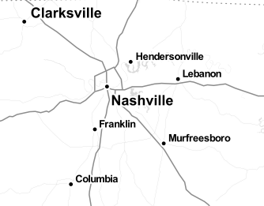
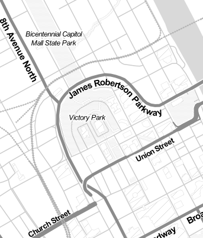
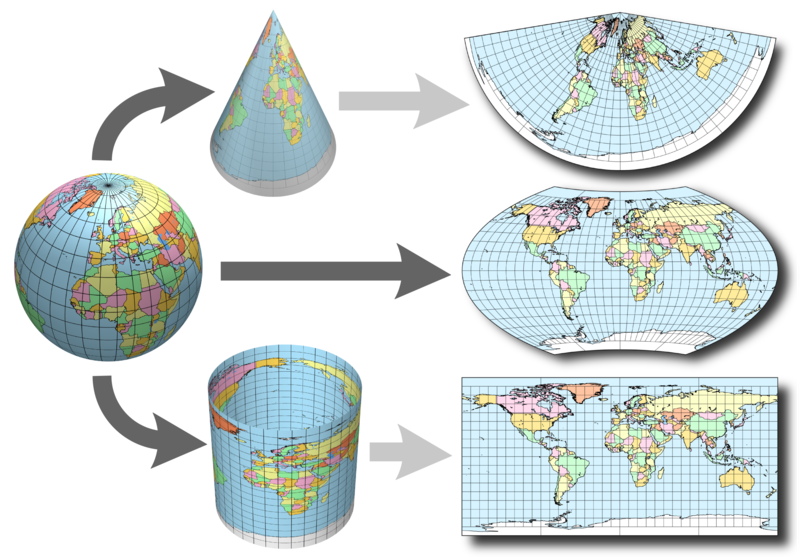

layout: true
class: center, middle, inverse
---
#An intro to geospatial development 
Eric Goddard  
Center for Applied Earth Science and Engineering Research
---
layout: false
class: left, middle
# Outline   
.left[
- GIS crash course 
- Why you should learn about spatial 
- Web app 
]
---
# Geographic Information Systems
--

##GIS -  A system for managing and analyzing data that has a spatial component
---

class: center, middle, inverse
# Which sounds a lot like...  
--

## a database.
--

### with functions that allow you to query based on location and spatial relationships.
---
class: center, middle, but

#BUT
---
class: center, middle, inverse
#Spatial is special.red[*]

---
class: center, middle, inverse
##Just like any other field, there are a few things you need to know when working with spatial data.
---
class: center, middle
# GIS Crash Course
---
class: center
# Data Types
.left[
1. Vectors
    - Points
    - Lines
    - Polygons
2. Rasters
]
---
class: center, middle
<a href="http://leaflet.github.io/Leaflet.draw/" target="_blank"><h1>Data Types Example</h1></a>
???
use drawnItems.getLayers()[index]._latlng for points
drawnItems.getLayers()[index]._latlngs for lines/polygons

---
class: center
#Scale
1. Small scale - a big area with little detail
--

.center[]
---
class: center
#Scale
2. Large scale - a small area with a lot of detail
--

.center[]
---
# Projections
Maps: projecting a sphere onto a flat surface
* Can preserve area, OR distances OR shape OR direction, but not all
---
.center[]
---
background-image: url(./images/south_america_projections.gif)
---
background-image: url(./images/threepro.gif)
---
# Desktop/Server
1. Esri ArcGIS - [http://www.esri.com](http://www.esri.com)

2. QGIS - [http://www.qgis.org](http://www.qgis.org)

3. GDAL - [http://www.gdal.org](http://www.gdal.org)

4. PostGIS - [http://www.postgis.org](http://www.postgis.org)

---
# Web/Mobile
1. Leaflet - [http://www.leafletjs.com](http://www.leafletjs.com)

2. OpenLayers - [http://www.openlayers.org](http://openlayers.org)

3. ArcGIS API for JavaScript - [https://developers.arcgis.com/javascript/](https://developers.arcgis.com/javascript/)
---
# Why should you study GIS?
--

- \> 80%* of data has a spatial component
--

- More job opportunities
--

- It's ubiquitous in mobile/web
    - You will probably be asked to put something on a map at some point...
---
class: center, middle, inverse
# and now...
---
background-image: url(./images/beer_prediction.jpg)

